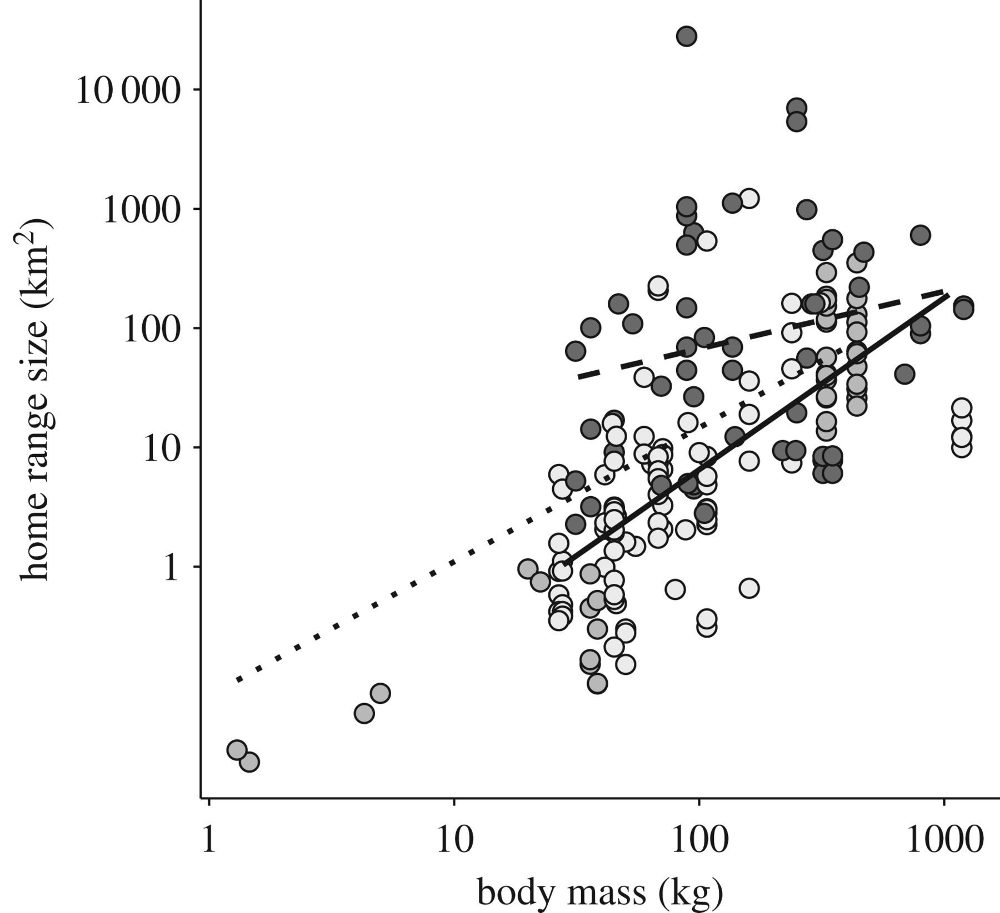

```{r setup, include=FALSE}
knitr::opts_chunk$set(echo = FALSE,warning = FALSE)

library(readr)
library(tidyverse)
library(dbplyr)
library(kableExtra)
library(httpuv)
library(caTools)
library(ggplot2)
library(broom)
library(MuMIn)
```

## Introducción 

Basado en la base de datos [**PanTHERIA**](http://esapubs.org/archive/ecol/E090/184/) quiero mostrar en el informe final la relación entre el peso adulto y el rango de hogar de mamiferos, seleccionando el orden Primates y Carnivora.

{width=350px}

## Por qué la selección

- Por el ejemplo anterior [@ofstad2016home].
- Seleccioné esos ordenes porque tengo una suficiente cantidad de datos para trabajar (220), siendo 80 de Carnivora y 140 de primates (Tabla 1).
- La relación peso y rango de hogar, se puede establecer un modelo. 

``` {r tabla1, include=FALSE}
Tabla <- read_delim("C:/Users/cibal/OneDrive/Escritorio/Tarea R/PanTHERIA_1-0_WR05_Aug2008.txt", 
                    "\t", escape_double = FALSE, trim_ws = TRUE)

Tabla <- select(Tabla, Order = "MSW05_Order", AdultMass_g = "5-1_AdultBodyMass_g", HomeRange_km2 = "22-1_HomeRange_km2", PopulationDensity_n_km2 = "21-1_PopulationDensity_n/km2", Family = "MSW05_Family")

Tabla <- filter(Tabla, HomeRange_km2 > -998)
Tabla <- filter(Tabla, AdultMass_g > - 998)
Tabla <- filter(Tabla, PopulationDensity_n_km2 > -998)
TablaA <- filter(Tabla, Order == "Primates")
TablaB <- filter(Tabla, Order == "Carnivora")
Tabla <- bind_rows(TablaA, TablaB)
Tabla1 <- group_by(Tabla, Order) %>% summarise(MeanAdultMass_g = mean(AdultMass_g), SD1 = sd(AdultMass_g), MeanHomeRange_km2 = mean(HomeRange_km2), SD2 = sd(HomeRange_km2))
```

## Tabla 
```{r, echo=FALSE}

options("kableExtra.html.bsTable" = T)

kable(Tabla1, digits = 2, caption = "Tabla 1. Datos seleccionados desde base de datos PanTHERIA") %>%
  kable_styling(bootstrap_options = c("striped", "hover", "condensed"))
```

## Visualización de la data

```{r grafico, fig.cap= "Figura 1. Relación entre el peso adulto y rango de hogar en mamíferos seleccionados", invisible = FALSE, echo=FALSE}
ggplot(Tabla, aes(x = AdultMass_g, y = HomeRange_km2)) + geom_point(aes(color = Order)) + geom_smooth(aes(), method = "lm") + ylim(0, 450) + xlim(0, 2e+5)
```

## Divididos por orden

```{r grafico2, fig.cap= "Figura 2. relación entre el peso adulto y rango de hogar en mamíferos seleccionados", invisible = FALSE, echo=FALSE}
ggplot(Tabla, aes(x = AdultMass_g, y = HomeRange_km2)) + geom_point(aes(color = Order)) + geom_smooth(aes(), method = "lm") + ylim(0, 450) + xlim(0, 2e+5) + facet_wrap(~Order)
```

## Modelo: Cómo se puede explicar la diferencia? 

```{r lineal}
Fit1 <- lm(HomeRange_km2 ~ AdultMass_g, data = TablaA)
Sum1 <- glance(Fit1) %>% select(r.squared, p.value)

kable(Sum1, caption = "Tabla 2. Modelo lineal para primates", digits = 6) %>% 
  kable_styling(bootstrap_options = c("striped", "hover", "condensed"))
```

```{r lineal2}
Fit2 <- lm(HomeRange_km2 ~ AdultMass_g, data = TablaB)
Sum2 <- glance(Fit2) %>% select(r.squared, p.value)

kable(Sum2, caption = "Tabla 3. Modelo lineal para carnivora", digits = 15) %>% 
  kable_styling(bootstrap_options = c("striped", "hover", "condensed"))
```

## Qué queda... 

- Con qué variable se podria general un mejor modelo?
- Identificar las especies y buscar más información sobre ellas 
- Descarté la densidad poblacional -> pocos datos seleccionados al filtrar

## Tarea 1

- Lista de genes desde un GRO-seq regulados por Reelina, proteína de matriz extracelular, con la que estoy trabajando en mis unidades de investigación. (@telese2015lrp8)
- Quería identificar los genes que se encuentran en el rango -1 a 1 del Log del fold change (LogFC) reportados en el paper, por gráfico (Grafico 2) para ver la distribución y por tabla.
- Quiero ver una forma de clasificarlos, quizás con otra base de datos.

## Gráfico 2

```{r tarea1, fig.cap= "Figura Tarea1. Genes activados por Reelina"}
library(readxl)
List <- read_excel("C:/Users/cibal/OneDrive/Escritorio/Tarea R/Tarea1/List.xlsx", 
                   col_types = c("text", "text", "numeric", 
                                 "numeric"), skip = 1)
library(tidyverse)
library(dplyr)
List <- separate(List, c("Annotation"), "Name")
List$FDR <- log10(List$FDR)

library(ggplot2)
ggplot(List, aes(x = logFC, y = -FDR)) + geom_point(aes(color = Name)) + xlab("LogFC") + ylab("-log10 FDR") + theme_bw() + theme(legend.position = "none")
```

## Tabla 1

```{r tarea 1}
library(readxl)
List <- read_excel("C:/Users/cibal/OneDrive/Escritorio/Tarea R/Tarea1/List.xlsx", 
                   col_types = c("text", "text", "numeric", 
                                 "numeric"), skip = 1)
library(tidyverse)
library(dplyr)
List <- separate(List, c("Annotation"), "Name")
List1 <- filter(List, logFC > -1) 
Listfiltrada <- filter(List1, logFC < 1)

kable(Listfiltrada, digits = 5, caption = "Tabla Tarea 1. Genes filtrados activados por Reelina") %>% kable_styling(bootstrap_options = c("striped", "hover", "condensed"))
```

## ¡Muchas Gracias!

## Referencias 
